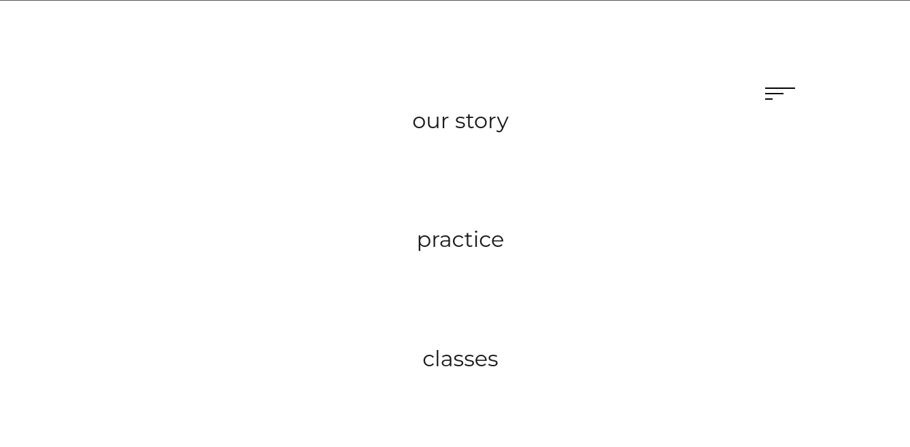

<h1 align="center">
   
</h1>

# Mind & Body

# Screens

## Technologies used

- [HTML](https://developer.mozilla.org/pt-BR/docs/Web/HTML)
- [CSS](https://developer.mozilla.org/pt-BR/docs/Web/CSS/)
- [Javascript](https://developer.mozilla.org/pt-BR/docs/Web/JavaScript/)

## How to use it

Open the index.html file in your browser
